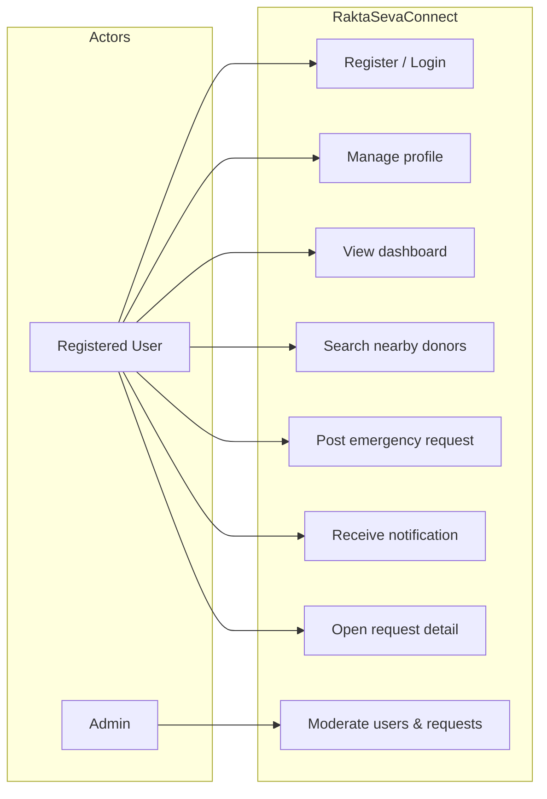
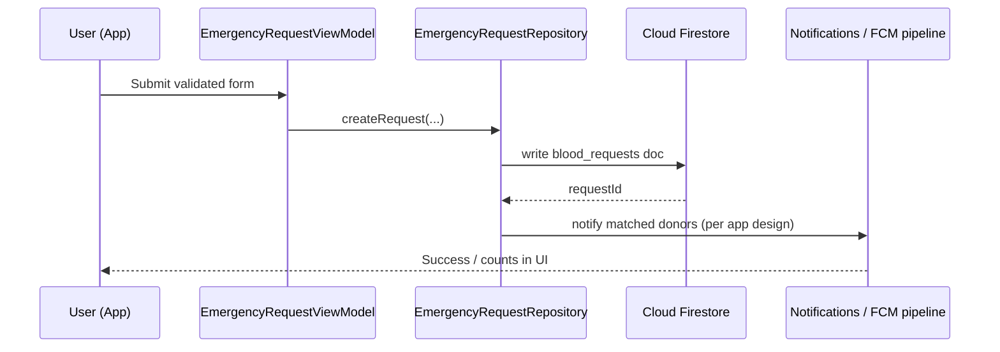
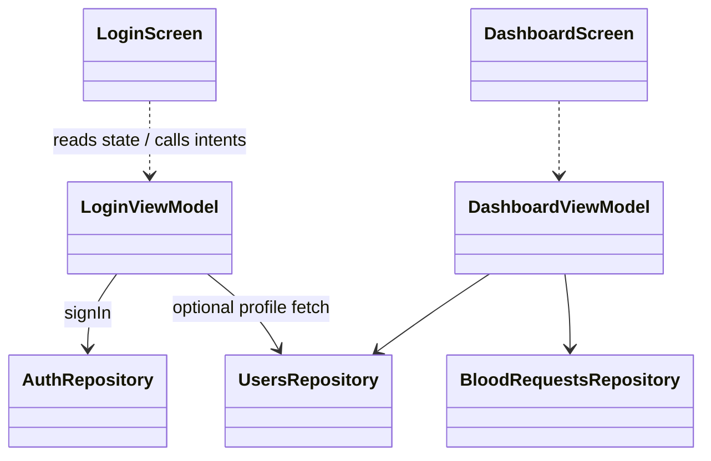

# Internship Project Report

**Title:** Rakta-Seva Connect – Android App Development using GenAI  

**Submitted in partial fulfilment of the requirements for the award of the degree of**  
**Bachelor of Engineering**  
**(Computer Science and Engineering / Information Science and Engineering)**  

**Visvesvaraya Technological University, Belagavi**

---

**Student Name:** _______________________________  
**USN:** _______________________________  
**Institution:** _______________________________  
**Internship Organization / Mode:** _______________________________  
**Duration:** _______________________________  
**Academic Year:** _______________________________  

**Guide / Internal Guide:** _______________________________  
**HOD:** _______________________________  
**Principal:** _______________________________  

---

## Certificate (for institute use)

This is to certify that the internship project report entitled **“Rakta-Seva Connect – Android App Development using GenAI”** is a bonafide work carried out by **Mr./Ms. _______________________** bearing USN **_______________________** in partial fulfilment for the award of Bachelor of Engineering in **_______________________** under Visvesvaraya Technological University, Belagavi, during the academic year **_______________________**.

**Signature of Guide**    **Signature of HOD**    **Signature of Principal**

**External Examiner**    **Date:**

---

## Acknowledgement (template)

The candidate expresses sincere gratitude to the institution, project guide, family, and peers for their support during the internship. Generative AI tools (e.g., large language model–based coding assistants) were used under academic integrity guidelines to accelerate learning, documentation, and code iteration; design decisions, testing, and final accountability remain with the student.

---

## Table of Contents

1. [Abstract](#1-abstract)  
2. [Introduction](#2-introduction)  
3. [Problem Statement](#3-problem-statement)  
4. [Objectives](#4-objectives)  
5. [Scope](#5-scope)  
6. [Existing System](#6-existing-system)  
7. [Proposed System](#7-proposed-system)  
8. [System Architecture](#8-system-architecture)  
9. [Modules](#9-modules)  
10. [Technology Stack](#10-technology-stack)  
11. [Database Design](#11-database-design)  
12. [UML Diagrams](#12-uml-diagrams)  
13. [Advantages](#13-advantages)  
14. [Future Enhancements](#14-future-enhancements)  
15. [Testing](#15-testing)  
16. [Results](#16-results)  
17. [Conclusion](#17-conclusion)  
18. [References](#18-references)  

---

## 1. Abstract

Blood transfusion emergencies require rapid coordination between patients, hospitals, and voluntary donors. Traditional communication through phone chains and informal networks is slow, error-prone, and difficult to audit. **Rakta-Seva Connect** is a native **Android** application developed using **Kotlin** and **Jetpack Compose**, backed by **Google Firebase** (Authentication, Cloud Firestore, Cloud Messaging). The system enables user registration, donor discovery using coarse/fine location, posting of emergency blood requests, in-app and push notifications, optional administrative moderation, and deep linking from notifications to request details.

The internship emphasised **Android application engineering**, **cloud-backed mobile architecture**, and responsible use of **Generative Artificial Intelligence (GenAI)** tools to accelerate documentation, UI scaffolding, and refactoring while preserving manual verification, security review, and testing. The outcome is a modular **MVVM** codebase suitable for demonstration, further research, and deployment with proper Firebase configuration and institutional governance.

**Keywords:** Android, Kotlin, Jetpack Compose, Firebase, FCM, Firestore, MVVM, Blood Donation, Generative AI, Internship.

---

## 2. Introduction

Mobile computing and cloud services have transformed healthcare logistics. In the Indian context, voluntary blood donation is culturally strong but **spatially and temporally mismatched** with demand spikes during accidents, surgeries, and obstetric emergencies. Smartphone penetration enables **real-time**, **location-aware** matching between donors and requesters.

This internship project implements **Rakta-Seva Connect**, a socially oriented Android client that demonstrates how a small engineering team (or a student intern supported by tooling) can deliver a **minimum viable product (MVP)** with authentication, geo-assisted donor search, emergency request workflows, and push-driven engagement.

The subtitle **“Android App Development using GenAI”** reflects the pedagogical reality of 2024–2026 software internships: **GenAI assistants** (code completion, chat-based pair programming, documentation synthesis) are used to improve productivity. The report documents both the **software artefact** and the **process**, aligning with VTU expectations for technical depth, ethics, and traceability.

---

## 3. Problem Statement

Despite widespread use of messaging applications for blood appeals, stakeholders face the following limitations:

1. **Unstructured data:** Critical attributes (blood group, units, hospital, coordinates) are buried in free text.  
2. **Weak discoverability:** Donors who are nearby and eligible may never see a request.  
3. **No single audit trail:** Past donations, fulfilled requests, and accountability are hard to reconstruct.  
4. **Permission and trust gaps:** Broadcasting phone numbers publicly raises privacy concerns.  
5. **Operational load:** Volunteers manually forward messages; scale breaks under crisis load.

The project addresses a **subset** of these problems through a structured mobile client and a **NoSQL cloud database** with security rules, notifications, and optional admin workflows—without claiming to replace blood banks or regulatory systems.

---

## 4. Objectives

### Primary objectives

1. To design and implement an **Android** application for donor registration, profile management, and emergency blood request posting.  
2. To integrate **Firebase Authentication** for secure identity and **Cloud Firestore** for structured persistence.  
3. To implement **Firebase Cloud Messaging (FCM)** for alerting users and **deep linking** into request detail screens.  
4. To apply **MVVM architecture** with lifecycle-aware UI state using **Kotlin coroutines** and **StateFlow**.  
5. To document **GenAI-assisted development** practices, limitations, and academic integrity considerations.

### Secondary objectives

1. To provide **nearby donor search** using device location and client-side filtering (radius, cooldown).  
2. To implement a **simple admin panel** for moderation (user block/unblock, request deletion, aggregate statistics views).  
3. To prepare **deployment artefacts** (Firestore rules, indexes, schema documentation).

---

## 5. Scope

### In scope

- Android client (min SDK 26, target/compile SDK 35 in current configuration).  
- Email/password authentication; user profile stored in Firestore.  
- Dashboard, donor search, emergency request creation, notifications surface.  
- FCM token registration; local high-importance notifications for foreground/background handling patterns.  
- Admin role gated by Firestore `role` field and security rules.  
- Documentation: README, schema notes, internship report.

### Out of scope (explicit)

- Hospital information system (HIS) integration, blood bank inventory, cross-matching logic, regulatory compliance (e.g., complete NABH traceability).  
- iOS / Web clients (may be derived later from the same Firebase backend).  
- Payment, insurance, or donor incentives.  
- Clinical decision support (the app is **logistic/coordination**, not medical advice).

---

## 6. Existing System

### Conventional approaches

1. **WhatsApp / SMS chains:** Fast to start but unstructured; poor search and privacy.  
2. **Static websites / Google Forms:** Capture intent but lack real-time push and geo-awareness on mobile.  
3. **Commercial blood-bank apps:** Often region-locked, closed-source, or not aligned with academic internship goals.

### Limitations relevant to this project

- Lack of **programmable** notification workflows tied to structured request documents.  
- Limited **internship transparency**: closed systems do not demonstrate student-authored security rules and cloud schema design.

---

## 7. Proposed System

**Rakta-Seva Connect** proposes a **mobile-first**, **Firebase-backed** coordination layer:

- **Structured requests** as documents with typed fields (`bloodGroupNeeded`, `unitsRequired`, `hospitalName`, `latitude`, `longitude`, `status`, etc.).  
- **Structured user profiles** with donor flags, availability, optional coordinates, and moderation flags (`isBlocked`).  
- **Notifications** collection for in-app history; FCM for device delivery.  
- **Admin** operators (role-based) for deleting abusive requests and blocking users, subject to deployed rules.

GenAI tools support the intern in **accelerating boilerplate** (Compose layouts, repository stubs, narrative documentation) while the student performs **integration testing**, **rule review**, and **demonstration preparation**.

---

## 8. System Architecture

### 8.1 High-level architecture

The system follows a **three-tier** pattern adapted for mobile cloud backends:

| Tier | Components |
|------|------------|
| **Presentation** | Jetpack Compose UI, Navigation, ViewModels, Material 3 theme |
| **Application / Domain glue** | Repositories, validators, utilities (geo, donor filters) |
| **Data / Infrastructure** | Firebase Auth, Firestore, FCM, Play Services Location |

### 8.2 Logical architecture (textual)

```
[ User ] ⇄ [ Android App (Compose + ViewModel) ]
                    ⇅ HTTPS
            [ Firebase Auth | Firestore | FCM ]
                    ⇅ (optional)
            [ Cloud Functions / Admin SDK ]
```

### 8.3 MVVM within the Android app

- **Model:** Kotlin data classes mapping Firestore documents; repository classes perform I/O.  
- **ViewModel:** Exposes immutable `StateFlow` snapshots to UI; launches coroutines in `viewModelScope`.  
- **View:** Composable functions render state and forward user intents (clicks, form edits) to ViewModel.

### 8.4 GenAI in the engineering process (not a runtime module)

GenAI is used as a **development accelerator** (IDE-integrated assistants) for:

- Scaffold generation (screens, navigation routes).  
- Refactoring suggestions (lifecycle-aware collection, permission flows).  
- Documentation drafting (README, report sections).  

**Accountability model:** the intern validates all generated code against compiler output, linter hints, manual test cases, and institutional anti-plagiarism norms.

---

## 9. Modules

| Module | Description |
|--------|-------------|
| **Authentication** | Login, registration, sign-out; Firebase Auth session. |
| **User profile / Firestore user document** | CRUD patterns for `users/{uid}`; donor fields; FCM token merge. |
| **Dashboard** | Aggregated view: active requests, alerts, donation status summary, availability toggle. |
| **Nearby donors** | Runtime location permission; Firestore query + client-side radius and 90-day cooldown filter. |
| **Emergency request** | Validated form; persists `blood_requests`; triggers notification workflow (per project configuration). |
| **Notifications / FCM** | `FirebaseMessagingService`, notification channel, tap → `MainActivity` → pending request id → navigation. |
| **Request detail** | Reads a single blood request by id; supports deep link. |
| **Admin console** | Admin-authenticated screens: list users, block/unblock, list/delete requests, donation statistics slice. |
| **Theming / UX** | Material 3 healthcare-oriented palette; bottom navigation shell. |

---

## 10. Technology Stack

| Category | Technology |
|----------|------------|
| Language | Kotlin |
| UI | Jetpack Compose, Material 3 |
| Architecture | MVVM, StateFlow, Kotlin Coroutines |
| Navigation | Navigation-Compose |
| Backend BaaS | Firebase Auth, Cloud Firestore, Firebase Cloud Messaging |
| Location | Google Play Services Location (FusedLocationProviderClient) |
| Build | Gradle (Kotlin DSL), Android Gradle Plugin |
| IDE | Android Studio |
| AI-assisted development | GenAI coding assistants (policy per institution) |

---

## 11. Database Design

Firestore is a **document-oriented** database. The following collections are central to Rakta-Seva Connect (field lists are representative; refer to `firebase/FIRESTORE_SCHEMA.md` in the repository for authoritative detail).

### 11.1 Collection: `users` (document id = Firebase Auth UID)

| Field | Type | Description |
|-------|------|-------------|
| `displayName` | string | User’s name |
| `email` | string | Contact email |
| `phone` | string | Phone digits / E.164 subset |
| `role` | string | `user`, `admin`, etc. |
| `isDonor` | boolean | Donor registration flag |
| `isBlocked` | boolean | Moderation flag |
| `bloodGroup` | string | ABO/Rh label |
| `availabilityStatus` | string | Donor availability enum string |
| `latitude`, `longitude` | number | Optional WGS84 coordinates |
| `fcmTokens` | array&lt;string&gt; | Device tokens (capped in app logic) |
| `lastDonationDate` | timestamp | For cooldown messaging |
| `createdAt`, `updatedAt` | timestamp | Audit fields |

### 11.2 Collection: `blood_requests` (auto document id)

| Field | Type | Description |
|-------|------|-------------|
| `createdBy` | string | UID of creator |
| `patientName` | string | Patient or case label |
| `bloodGroupNeeded` | string | Required group |
| `unitsRequired` | number | Units requested |
| `hospitalName` | string | Facility name |
| `latitude`, `longitude` | number | Request location |
| `contactNumber` | string | Callback number |
| `emergencyLevel` | string | Severity label |
| `status` | string | `OPEN`, `FULFILLED`, `CANCELLED` |
| `createdAt`, `updatedAt` | timestamp | Audit fields |

### 11.3 Collection: `donations`

| Field | Type | Description |
|-------|------|-------------|
| `donorId` | string | UID |
| `requestId` | string | Optional link to request |
| `units` | number | Units recorded |
| `donationDate` | timestamp | When donation occurred |
| `verified` | boolean | Staff verification flag |
| `createdAt` | timestamp | Record creation |

### 11.4 Collection: `notifications`

| Field | Type | Description |
|-------|------|-------------|
| `userId` | string | Recipient UID |
| `type` | string | e.g. `BLOOD_REQUEST` |
| `title`, `body` | string | Display strings |
| `relatedRequestId` | string | Link to blood request |
| `read` | boolean | Read flag |
| `createdAt` | timestamp | Creation time |

### 11.5 Indexing and security

- Composite indexes are declared in **`firebase/firestore.indexes.json`** for common queries (e.g., donor filters, ordered lists).  
- Security rules in **`firebase/firestore.rules`** enforce authentication, ownership on writes, and **admin overrides** for moderation when `role == 'admin'`.

---

## 12. UML Diagrams

*Note: Diagrams below use Mermaid syntax. For VTU hardcopy, export images from a Mermaid-capable editor or redraw in StarUML / Draw.io.*

### 12.1 Use Case Diagram (high level)



### 12.2 Sequence diagram – Emergency request posted (conceptual)



### 12.3 Class diagram – MVVM layering (simplified)



---

## 13. Advantages

1. **Structured coordination** reduces ambiguity compared to unstructured chat appeals.  
2. **Push notifications** improve timeliness versus pull-only web forms.  
3. **Firebase** lowers DevOps burden for internship timelines (auth, database, messaging unified).  
4. **MVVM + Compose** improves testability and separation of concerns versus monolithic Activities.  
5. **GenAI-assisted development** can shorten iteration cycles when paired with rigorous validation.  
6. **Extensibility:** the same backend can support future web dashboards or hospital integrations.

---

## 14. Future Enhancements

1. **Geohash-based server queries** and Cloud Functions for scalable radius search.  
2. **Pagination** (`limit` + `startAfter`) for dashboards and admin lists.  
3. **Role-based access** via Firebase Custom Claims in addition to Firestore `role`.  
4. **End-to-end encryption** for sensitive fields (high engineering cost; needs domain experts).  
5. **Multi-language UI** (Kannada / Hindi / English) using string resources and translation services.  
6. **Hospital portal** (web) for verifying requests and donation records.  
7. **Automated testing:** Espresso/Compose UI tests, Firestore emulator–based integration tests.  
8. **Ethical AI:** on-device triage suggestions only under clinical governance (research direction; not implemented in MVP).

---

## 15. Testing

### 15.1 Types of testing performed (recommended checklist)

| Type | Purpose | Examples |
|------|---------|----------|
| **Unit testing** | Validators, pure filters (distance, cooldown) | `GeoUtils`, `DonorFilter` |
| **Integration testing** | Repositories against Firestore emulator | Optional in advanced submissions |
| **Manual testing** | UX, permissions, real-device FCM | Login, register, donor search, request post |
| **Security testing** | Rules behave for user vs admin | Attempt unauthorised deletes |

### 15.2 Test cases (sample)

| ID | Scenario | Expected |
|----|----------|----------|
| T1 | Register with invalid email | Inline validation error |
| T2 | Login with wrong password | Auth error mapped to user message |
| T3 | Location denied | Donor search degrades gracefully / prompts user |
| T4 | Post emergency request with valid fields | Document created; success dialog |
| T5 | Tap FCM notification | Opens request detail with matching id |
| T6 | Non-admin opens admin login | Rejected after Firestore role check |

### 15.3 GenAI-specific validation

- **Diff review:** all AI-suggested patches reviewed in version control.  
- **Compiler/linter:** zero-error policy before demo.  
- **Citation:** this report declares GenAI assistance where institution requires.

---

## 16. Results

1. A **functional Android MVP** demonstrating authentication, structured emergency requests, donor discovery, notifications, and optional admin flows.  
2. A **documented Firebase schema** and deployable **rules/index** artefacts.  
3. Improved **internship learning outcomes** in mobile cloud development and responsible GenAI use.  
4. A codebase suitable for **portfolio demonstration** and extension in final-year projects.

*Quantitative metrics (e.g., latency in ms, number of test cases passed) should be inserted here after the student runs timed trials on a specified device and network.*

---

## 17. Conclusion

Rakta-Seva Connect demonstrates that a **VTU-aligned internship** can deliver a socially relevant Android application using modern **Kotlin**, **Jetpack Compose**, and **Firebase**, while critically engaging **Generative AI** as a productivity tool rather than a substitute for engineering judgement. The project addresses real coordination pain points in a limited scope appropriate to an academic timeline, and it establishes a foundation for future research in scalable geo-matching and hospital integration.

The student recommends **institutional policies** that require explicit disclosure of GenAI assistance, retention of human-reviewed artefacts (commit history, test logs), and continued emphasis on **security rules** and **privacy** as differentiators over raw feature count.

---

## 18. References

1. Google LLC. *Firebase Documentation* – Authentication, Firestore, Cloud Messaging.  
   https://firebase.google.com/docs  

2. Google LLC. *Jetpack Compose* – UI toolkit documentation.  
   https://developer.android.com/jetpack/compose  

3. Google LLC. *Android Developers* – App architecture guide (UI layer, ViewModel).  
   https://developer.android.com/topic/architecture  

4. Android Open Source Project. *Material Design 3*.  
   https://m3.material.io/  

5. Visvesvaraya Technological University. *VTU academic regulations and internship guidelines* (as applicable to the student’s programme and revision).  

6. Kotlin Foundation. *Kotlin Language Documentation*.  
   https://kotlinlang.org/docs/home.html  

7. JetBrains. *Kotlin Coroutines Guide*.  
   https://kotlinlang.org/docs/coroutines-guide.html  

8. Gamma, E., Helm, R., Johnson, R., & Vlissides, J. (1994). *Design Patterns: Elements of Reusable Object-Oriented Software.* Addison-Wesley. (Software engineering context for patterns used in MVVM-related discussions.)  

9. Firebase. *Firestore Security Rules* – language reference.  
   https://firebase.google.com/docs/firestore/security/rules-structure  

10. OpenAI / Anthropic / Google (as applicable). **Generative AI product documentation** used during development; cite per institutional policy on AI citation.

---

## Appendices (optional for binding)

- **Appendix A:** Screenshots (login, dashboard, donor list, emergency form, admin console).  
- **Appendix B:** Git commit log excerpt (hash range, dates).  
- **Appendix C:** Firebase console configuration checklist.  
- **Appendix D:** Declaration of originality and GenAI use (per VTU / college format).

---

*End of Report*
